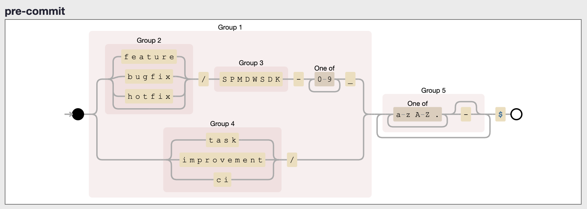
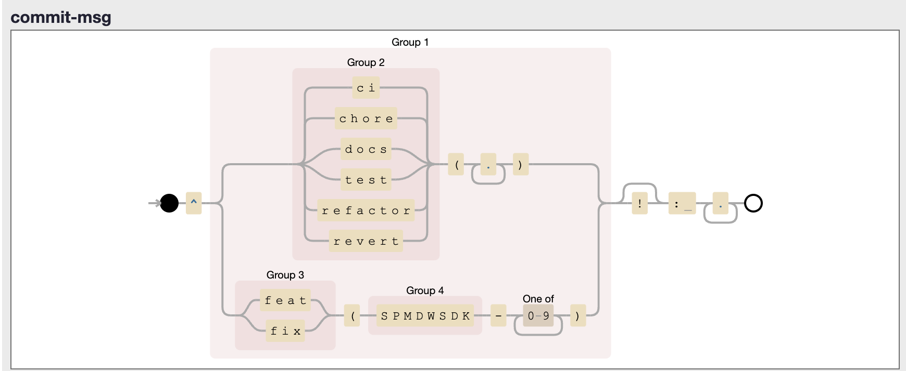

# android-SpaceMiddleware

[](https://ciq-quality.mpsa.com/dashboard?id=com.inetpsa.sp4%3ASp400Projects_SpaceMiddleware_Android)

# Sonar Report

[](https://ciq-quality.mpsa.com/dashboard?id=com.inetpsa.sp4%3ASp400Projects_SpaceMiddleware_Android) [](https://ciq-quality.mpsa.com/dashboard?id=com.inetpsa.sp4%3ASp400Projects_SpaceMiddleware_Android) [](https://ciq-quality.mpsa.com/dashboard?id=com.inetpsa.sp4%3ASp400Projects_SpaceMiddleware_Android) [](https://ciq-quality.mpsa.com/dashboard?id=com.inetpsa.sp4%3ASp400Projects_SpaceMiddleware_Android) [](https://ciq-quality.mpsa.com/dashboard?id=com.inetpsa.sp4%3ASp400Projects_SpaceMiddleware_Android) [](https://ciq-quality.mpsa.com/dashboard?id=com.inetpsa.sp4%3ASp400Projects_SpaceMiddleware_Android) [](https://ciq-quality.mpsa.com/dashboard?id=com.inetpsa.sp4%3ASp400Projects_SpaceMiddleware_Android) [](https://ciq-quality.mpsa.com/dashboard?id=com.inetpsa.sp4%3ASp400Projects_SpaceMiddleware_Android) [](https://ciq-quality.mpsa.com/dashboard?id=com.inetpsa.sp4%3ASp400Projects_SpaceMiddleware_Android) [](https://ciq-quality.mpsa.com/dashboard?id=com.inetpsa.sp4%3ASp400Projects_SpaceMiddleware_Android)

# SpaceMiddleware 1.2.15-SNAPSHOT

**Date of creation :** 24/10/2022  **Last Update:** 20/12/2023

## 1. Introduction

The purpose of this document is to technically specify the integration of **SpaceMiddleware**
component.

## 2. Requirement

## 3.Dependencies

SpaceMiddleware depends on other framework to work:

| Component  | Version     |
|------------|-------------|
| Foundation | **1.12.25** |

## 4. Integration

The Gradle dependency is available via PSA artifactory repository.

```groovy
dependencies {
    implementation 'com.inetpsa.mmx:SpaceMiddleware:1.2.15-SNAPSHOT'
}
```

## 5. Branch name convention

the branch name should respect this regex to can be pushed to remote


## 5. Commit message convention

the commit message should respect this regex to can be accepted

